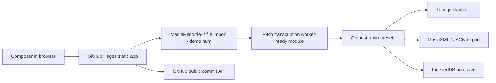

# Hum-to-Orchestra


Live app: https://baditaflorin.github.io/hum-to-orchestra/

Repository: https://github.com/baditaflorin/hum-to-orchestra

Support: https://www.paypal.com/paypalme/florinbadita

Hum-to-Orchestra turns a sung melody into five browser-playable arrangements: string quartet, brass ensemble, baroque consort, electronic four-on-the-floor, and full orchestra.


## Quickstart

```bash
npm install
npm run dev
npm run build
npm run test
npm run smoke
```

## What Works In V0.1.0

- Record from the microphone, import an audio file, or load a built-in demo hum.
- Extract a pitch contour in the browser with Web Audio and `pitchy`.
- Convert stable pitch segments into quantized melody notes.
- Arrange the melody into five preset ensembles.
- Play the realization with Tone.js, lazy-loaded on first playback.
- Export MusicXML for notation and Music21-compatible workflows, plus JSON project data.
- Autosave the last project to IndexedDB.
- Show the app version, build commit, live main commit, GitHub star link, and PayPal support link.

## Architecture



Detailed architecture: docs/architecture.md

ADRs: docs/adr/

Deployment guide: docs/deploy.md

Privacy: docs/privacy.md

## Git Hooks

```bash
make install-hooks
```

Hooks live in `.githooks/` and run local checks only. This project intentionally does not use GitHub Actions.

## Project Status

This is a Mode A static GitHub Pages app. There is no runtime backend, no auth, no secrets, no Docker image, and no server-side metrics.
