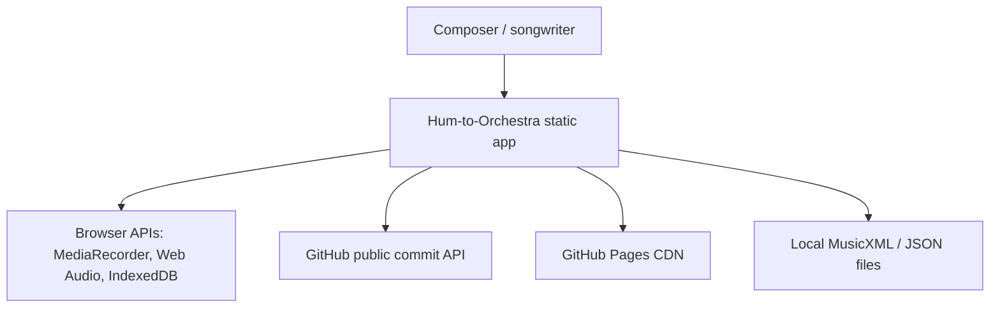
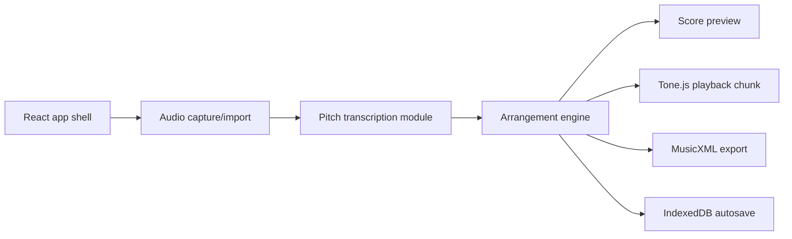

# Architecture

Hum-to-Orchestra is a Mode A static web app served entirely by GitHub Pages.

Live app: https://baditaflorin.github.io/hum-to-orchestra/

Repository: https://github.com/baditaflorin/hum-to-orchestra

## C4 Context

## C4 Container

## Module Boundaries

- `src/features/audio/`: browser audio decoding and pitch transcription.
- `src/features/orchestration/`: deterministic arrangement presets and score generation.
- `src/features/playback/`: lazy Tone.js playback adapter.
- `src/features/export/`: MusicXML and JSON export.
- `src/features/storage/`: IndexedDB persistence.
- `src/components/`: focused UI views.
- `docs/`: GitHub Pages build output plus documentation and ADRs.

## GitHub Pages Boundary

Everything under `docs/` is public static content. There is no runtime server, runtime database, backend auth, or secret-bearing API.
